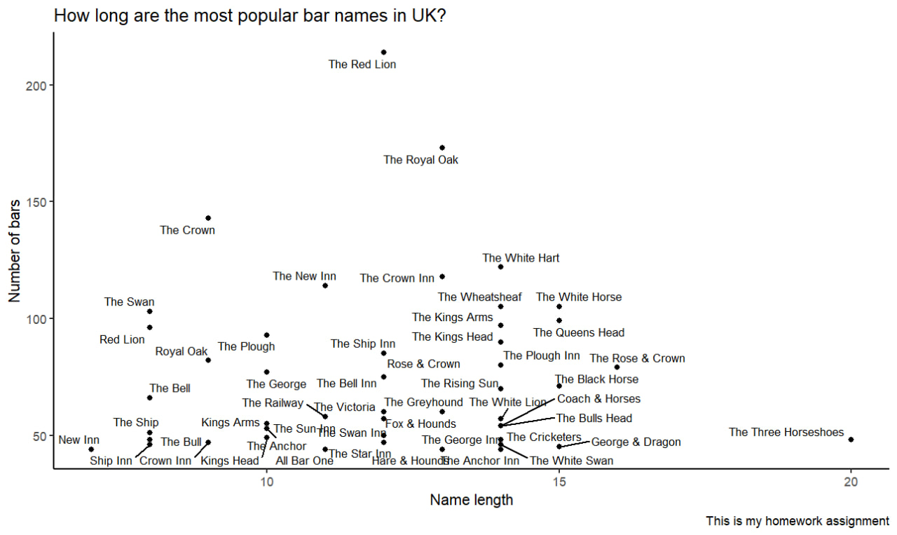
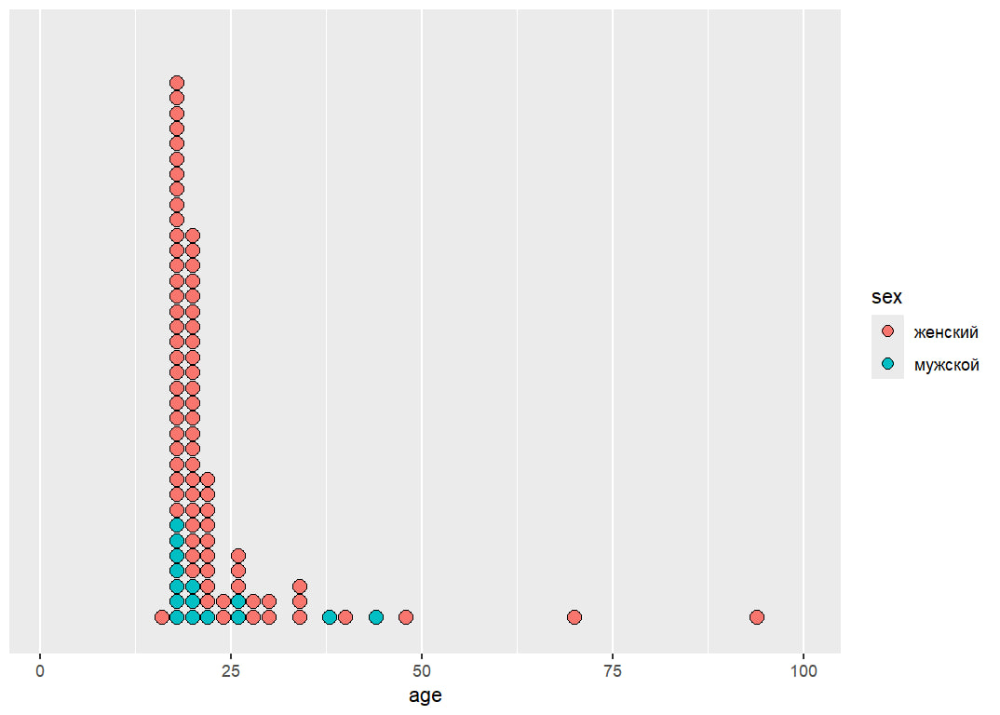

# Assignment 1

## Task 1
#### Packages
```{r}
library('tidyverse')
library('stringi')
library('ggrepel')
```
##### Reading the file
```{r}
pub_data <- read.csv('https://raw.githubusercontent.com/vydra-v-getrax/intro_to_r/main/assignment1/UK_pubs.csv ')
```
##### I need to count how many times each name occurs in the list and sort the list, then cut the top 50 of the list
```{r}
pub_data %>%
  group_by(pub_name, nchar(pub_name)) %>% 
  summarise(n())

pub_data_sorted <- pub_data %>%
  count(pub_name, sort = TRUE)
```
##### Top 50 common bar names
```{r}
pubs_50 <- pub_data_sorted[1:50, ]
```
# Adding a column with the number of chars
```{r}
pubs_50 <- pubs_50 %>%
  mutate(name_length = nchar(pub_name))
```
#### Plot
```{r}
pubs_50%>%
  ggplot(aes(name_length, n))+
  geom_point()+
  labs(x = "Name length",
       y = "Number of bars",
       title = "How long are the most popular bar names in UK?",
       caption = "This is my homework assignment")+
  geom_text_repel(aes(label = pub_name), size = 3, max.overlaps = Inf)+
  theme_classic()
```


## Task 2
```{r}
mad_data <- read.csv('https://raw.githubusercontent.com/vydra-v-getrax/intro_to_r/main/assignment1/mad_questionary.csv')
```

##### Switching everything to lowercase
```{r}
mad_data <- mad_data %>% 
  mutate(sex = tolower(sex))
```
##### I'm using regular expressions for cleaning the data
```{r}
mad_data$sex <- sub("^ж.*$", "женский", mad_data$sex)
mad_data$sex <- sub("^м.*$", "мужской", mad_data$sex)
```

##### Fixing the issues I found in the age column
```{r}
mad_data$age <- sub("18 лет", 18, mad_data$age)
mad_data <- mad_data %>% 
  mutate(age = as.numeric(age))
```

##### Plot
```{r}
mad_data %>% 
  ggplot(aes(x = age, fill = sex))+
  geom_dotplot(method = 'histodot', binwidth = 2, binpositions = all)+
  scale_x_continuous(limits = c(1, 100))+
  scale_y_continuous(NULL, breaks = NULL)
```

